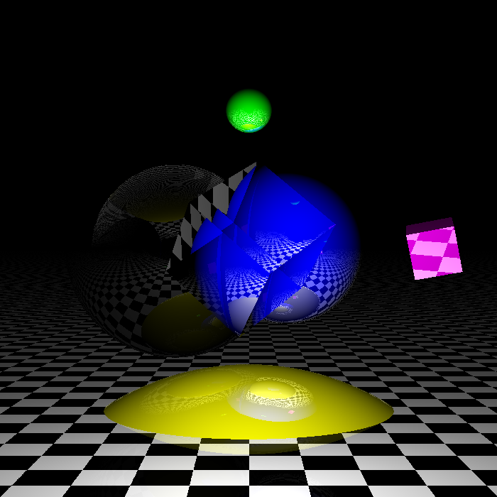

# ray_tracer
Simple ray tracer in python

To run, start a Python 2.7 virtualenv, `pip install -r requirements.txt`, and then run `python test.py`

## Features
* Point light sources
* Reflection and refraction
* Cubes, spheres, and infinite planes

## Example

